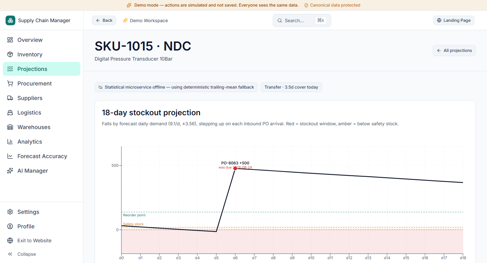

# Supply Chain Manager

## [→ Live demo — no signup required](https://supply-chain-manager-mocha.vercel.app/dashboard/overview?demo=true)

Opens directly into a populated dashboard pre-loaded with a seeded 4-warehouse dataset. Nothing to create, nothing to configure. Writes (1-click orders, stock adjustments, imports) are intercepted as simulations in this mode — the canonical data stays pristine for the next visitor.

---

An inventory replenishment and operations-health platform for distributors and wholesale suppliers. It reads 90 days of transaction history, supplier lead times, and stock levels across every warehouse, and turns that into a daily-updated health score, time-phased reorder/expedite/transfer recommendations, and a stockout-projection view per SKU — built to answer "what do I need to order today, and why" without a planner building a pivot table first.

## Screenshot



The projected on-hand balance for one SKU at one warehouse, walked forward day by day: it declines at the forecast demand rate, crosses into the red stockout band, then steps up sharply when PO-8063 lands — with its revised ETA shown alongside the date it was originally due, since it arrived late. The badge above the chart states the forecasting mode currently in effect; this capture landed on a cold start, which is itself the honest, expected behavior (see Limitations).

---

## Architecture

```
┌────────────────────────────────────────────────────────────────────────┐
│                        Next.js 16 Web App (Vercel)                     │
│  ┌─────────────────────────────────┐  ┌─────────────────────────────┐  │
│  │   Domain Engine & Metrics Layer │  │   Smart Importer Pipeline   │  │
│  │   (Time-Phased Netting Math)    │  │   (Header Detection, Fuzzy) │  │
│  └─────────────────────────────────┘  └─────────────────────────────┘  │
└──────────────────┬─────────────────────────────────┬───────────────────┘
                   │ Prisma ORM (Pooled)             │ HTTPS + X-Forecast-Secret
                   ▼                                 ▼
┌──────────────────────────────────────┐ ┌───────────────────────────────┐
│     PostgreSQL Database (Neon)       │ │  Python Forecasting Service   │
│  • Warehouses, Suppliers, Products   │ │  (FastAPI, on Vercel)         │
│  • Inventory, POs, 90d Transactions  │ │  • 7-Model Rolling Tournament │
│  • Canonical Dataset Protection      │ │  • Croston SBA, Holt-Winters  │
└──────────────────────────────────────┘ └───────────────────────────────┘
```

The web app and the forecasting service are two separately deployed projects. The web app calls the forecasting service over authenticated HTTPS for the model-tournament path (Forecast Accuracy page, stockout projections); the core reorder-point math below runs independently, in the web app itself, and never depends on the Python service being reachable.

## The forecasting approach

- **Time-phased, not flat netting.** Replenishment isn't "on-hand minus reorder point." The engine walks forward day by day across the supplier's lead time plus review period, crediting each inbound PO on the day it's projected to land and debiting daily demand, until it finds the day the balance would cross zero (if ever). That day-by-day walk is the same data structure that draws the sawtooth chart above — the chart and the reorder alerts read one shared function, so they can't disagree.
- **Safety stock from demand variability**, not a flat percentage: $SS = Z_{0.95} \times \sqrt{L \cdot \sigma_d^2 + \bar{d}^2 \cdot \sigma_L^2}$ — it scales with how erratic the demand *and* the supplier's delivery timing actually are, not a guessed buffer.
- **Per-series model tournament.** The Python service rolling-origin cross-validates 7 classical methods (Naive, Seasonal Naive, SMA 7d/14d, Simple Exponential Smoothing, Holt Linear Trend, Holt-Winters, Croston/Croston SBA) independently for every SKU × warehouse pair, and the lowest out-of-fold WAPE wins — a fast-moving SKU and an intermittent one don't get the same model.
- **Reorder vs. Expedite vs. Transfer** are three different answers to "the projection shows a problem":
  - **Reorder** — no PO is already in transit; cut a new one.
  - **Expedite** — a PO exists, but it's scheduled to land *after* the projected stockout date; the fix is to expedite it, not double-order.
  - **Transfer** — a sibling warehouse holds solvent surplus that can cover the gap without waiting on the vendor at all.

## M5 Competition demand forecasting benchmark

The tournament engine was benchmarked against the real Walmart **M5 Forecasting Competition** dataset — 210 time series across Foods, Household, and Hobbies — using rolling-origin 3-fold cross-validation with a 14-day forward horizon:

| Category | Model Candidate | WAPE | MASE vs Naive | Lift vs Naive |
| :--- | :--- | :--- | :--- | :--- |
| **Foods (Fast Moving)** | Naive (Last Value) | 24.7% | 1.000 | +0.0% |
| | Seasonal Naive (Weekly $m=7$) | 15.4% | 0.625 | +37.5% |
| | SMA (14-Day) | 21.3% | 0.865 | +13.5% |
| | Single Exp Smoothing (SES) | 21.3% | 0.864 | +13.6% |
| | Holt-Winters Additive | 21.3% | 0.864 | +13.6% |
| | Croston (SBA Debiased) | 21.5% | 0.871 | +12.9% |
| | **Tournament Winner** | **15.4%** | **0.622** | **+37.8%** |
| **Household (Moderate)**| Naive (Last Value) | 38.1% | 1.000 | +0.0% |
| | Seasonal Naive (Weekly $m=7$) | 37.2% | 0.977 | +2.3% |
| | SMA (14-Day) | 28.4% | 0.745 | +25.5% |
| | Single Exp Smoothing (SES) | 28.4% | 0.746 | +25.4% |
| | Holt-Winters Additive | 32.3% | 0.848 | +15.2% |
| | Croston (SBA Debiased) | 28.6% | 0.753 | +24.7% |
| | **Tournament Winner** | **28.0%** | **0.735** | **+26.5%** |
| **Hobbies (Intermittent)**| Naive (Last Value) | 157.8% | 1.000 | +0.0% |
| | Seasonal Naive (Weekly $m=7$) | 168.9% | 1.070 | *-7.0% (Worse)* |
| | SMA (14-Day) | 156.8% | 0.994 | +0.6% |
| | Single Exp Smoothing (SES) | 156.9% | 0.994 | +0.6% |
| | Holt-Winters Additive | 163.3% | 1.035 | *-3.5% (Worse)* |
| | Croston (SBA Debiased) | 156.6% | 0.992 | +0.8% |
| | **Tournament Winner** | **120.7%** | **0.765** | **+23.5%** |
| **OVERALL PORTFOLIO** | **Naive Baseline** | **73.5%** | **1.000** | **+0.0%** |
| | **Tournament Selection** | **54.7%** | **0.744** | **+25.6% Lift** |

**Where the naive baseline wins.** On Hobbies (sparse, low-velocity items), Seasonal Naive and Holt-Winters both *lose* to plain Naive by 3.5–7.0% — fitting a weekly seasonal pattern onto mostly-zero series overfits the zeroes. The tournament selector catches this per series and reverts to Croston SBA or a simple moving average instead of forcing a seasonal model where it doesn't belong.

## Limitations, stated plainly

- **The Smart Importer's "10/10 headers resolved" claim is a self-test, not a customer validation.** It was measured against `fixtures/messy_inventory_workbook.xlsx`, a workbook I wrote myself to exercise the header-detection logic — not a real customer file. Treat it as a demonstration of the scoring approach, not a measured accuracy rate.
- **No real customer has used this system.** Every number in the demo — OTIF rates, stockout projections, demand patterns — comes from a synthetic seeded dataset, not production usage.
- **The hosted demo caps imports at 5,000 rows per file**, enforced server-side. That's a public-instance safeguard, not a product ceiling — a self-hosted deployment can raise or remove it.
- **No payment processing is wired up.** The plan/billing UI writes to an in-memory store to demonstrate tier gating; it is not connected to Stripe or any processor.
- **Cold starts happen, and the app says so.** The forecasting service runs as a serverless function; after a period of inactivity, the first request can be slow enough to miss the web app's 2.5-second budget. When that happens, the dashboard falls back to a deterministic trailing-mean calculation automatically — and always labels which mode produced the numbers on screen, never silently.

## Getting started (local development)

```bash
# 1. Install dependencies
npm install

# 2. Configure environment variables
cp .env.example .env.local
# FORECAST_SERVICE_URL / FORECAST_SERVICE_SECRET are optional locally —
# without them the app runs correctly in fallback (trailing-mean) mode.

# 3. Start local Postgres database (Prisma dev server)
npm run db:dev

# 4. Apply migrations and seed canonical dataset
npm run db:migrate
npm run db:seed

# 5. Run test suites & verification
npm test
npm run test:verify

# 6. Start Next.js development server on port 3005
npm run dev
```

Open [http://localhost:3005](http://localhost:3005) to explore the application locally.

### Demo dataset

Org `org_demo` is pre-seeded with: 4 warehouses, 6 suppliers, 24 products, 49 inventory positions, 64 purchase orders, and ~3,900 transactions over 90 days. Because it's anchored to fixed historical dates while real time keeps moving, day-of-cover and OTIF figures drift slightly from any specific number quoted here — that's expected, not a bug.
